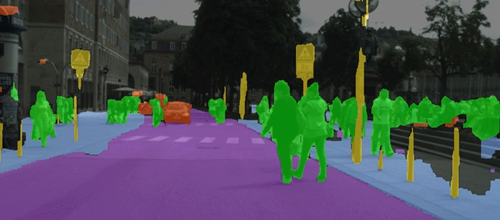
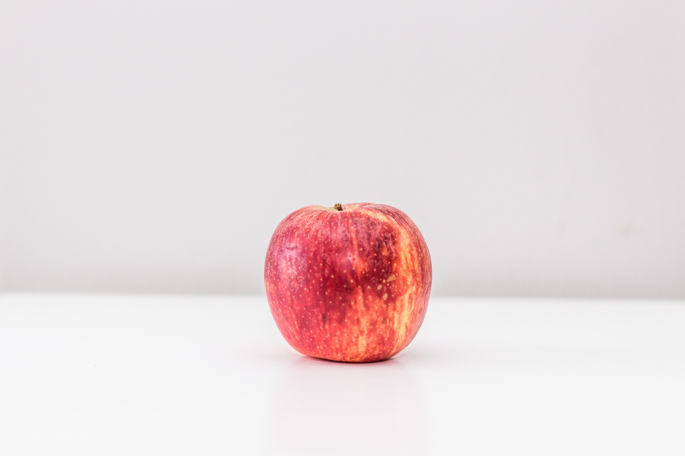

  # Image Segmentation

    > An Image is worth thousand words.

  Image segmentation is the process of partitioning an image into multiple segments or regions. Image segmentation is done to change or simplify the representation of an image into segments that are more meaningful (to the human eye) and easy to analyze. Image Segmentation is used to locate objects and boundaries in the image. A segment is a group of pixels, so image segmentation is assigning a label to every pixel, such that pixels with the same label have the same characteristics (like belonging to the same object).

  Image Segmentation has many uses and applications in the field of medical imaging, autonomous vehicles, geographic information systems, etc. 

  
  [Image from nvidia.com](https://blogs.nvidia.com/blog/2016/01/05/eyes-on-the-road-how-autonomous-cars-understand-what-theyre-seeing/)

  Lets look at some of the commonly used algorithms for image segmentation.

  ## Threshold Segmentation

  Threshold segmentation is a simple segmentation method, which divides an image (usually grayscale) into two segments : background and target object. In Thresholding, pixels of an image are partitioned into segments based on their intensity. In a grayscale image, the intensity of a pixel is represented by a number between 0 and 255. We choose a threshold value, and the pixels below the threshold are assigned a value of 1 (white) and pixels above the threshold are assigned a value of 0. This creates two segments, white background whose intensity is 1 and 

  //add formula here

  The method used above is called global thresholding where we use the same threshold value throughout the image, in local thresholding we change the threshold value depending on the intensities of the neighbouring pixel.

  Let's apply thresholding on the following image. The goal is to perform segmentation such that we can extract the apple from the background.

  

  Image from unsplash.

  Use [this interactive notebook](--------colablink-----------) to run the following code.

  ```python
  import cv2
  image = cv2.imread("apple.jpg", 0) #reading the image as a grayscale image.
  ret, low = cv2.threshold(img,85,255,cv2.THRESH_BINARY)
  ret, medium = cv2.threshold(img,155,255,cv2.THRESH_BINARY)
  ret, high = cv2.threshold(img,215,255,cv2.THRESH_BINARY)
  #plt.subplots
  #plt.show
  ```
  Grey Image

  

  Low threshold

  

  Medium Threshold

  

  High Threshold

  

  0 is black and 255 is white. In `cv2.threshold(image, threshold, max, type)` we choose `THRESH_BINARY`, in the target image it assigns 255 if intensity of pixel is greater than threshold, else assigns 0. We can see that if we take threshold too high, we cannot clearly separate between object and background. If we take threshold too low then some features of the object are not visible. To find the "perfect" threshold, there are many algorithms, lets look at **Otsu's Method**.

  ### Otsu's Method

  Otsu's method is used to find the optimal value for the global threshold. The algorithm searches all the possibilities for a threshold which minimises the weighted sum of variances of the two classes:

  

  ```python
  import cv2
  import matplotlib.pyplot as plt

  img = cv2.imread("apple.jpg", 0)
  ret,thresh1 = cv2.threshold(img,0,255,cv2.THRESH_BINARY+cv2.THRESH_OTSU)
  plt.imshow(thresh1,'gray')
  plt.show()
  ```

  

  If we look at the binarised image, it does an almost perfect job. The limitation with otsu's method is it needs a bimodal image for doing a perfect job of segmentation. A bimodal image is, when you draw the histogram of intensities of pixels then you should get two peaks. If you get two peaks, then the midpoint of those is a good threshold. 


  ## 

  ## References 
  - http://homes.di.unimi.it/ferrari/ImgProc2011_12/EI2011_12_16_segmentation_double.pdf
  - https://opencv-python-tutroals.readthedocs.io/en/latest/py_tutorials/py_imgproc/py_thresholding/py_thresholding.html
